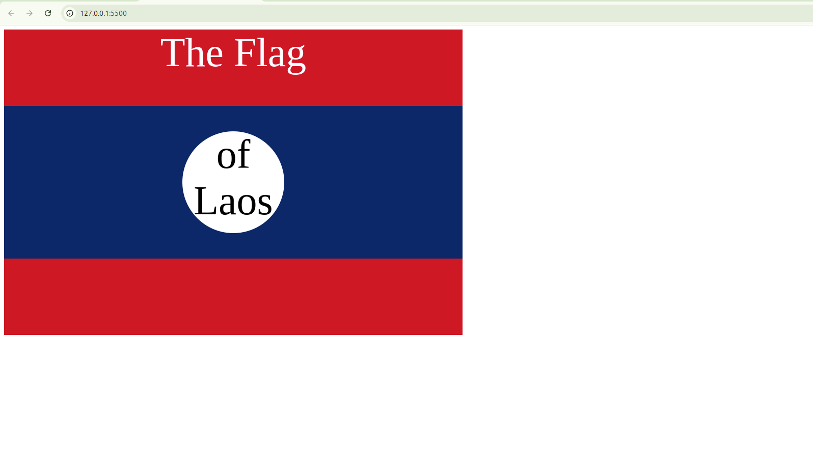

Here is a well-structured README for your project:

---

# 🇱🇦 Laos Flag Project

## 📖 **About the Project**
This project is part of the **"Become a Full-Stack Web Developer with just ONE course"** by **Dr. Angela Yu** on Udemy. It was completed after finishing **Section 7: Intermediate CSS** to practice and improve skills in CSS layout and positioning.

---

## 🛠 **Technologies Used**
- **HTML**: For structuring the content.
- **CSS**: For designing and styling the flag.

---

## 🎯 **Project Objectives**
- Apply **CSS layout techniques** to position elements properly.
- Utilize **CSS properties** to create a flag design.
- Improve skills in working with:
  - `background-color`
  - `positioning` (`absolute`, `relative`, `flexbox`)
  - `text styling` (`font-size`, `text-align`, `font-family`)

---

## 📂 **File Structure**
- `index.html`: Contains the structure of the flag.
- `styles.css`: Contains the styling rules.

---

## ✨ **Features**
1. **Flag Design:**
   - A **red-blue-red** flag pattern that matches the **Laos national flag**.
   - A centered **white circle** in the middle of the flag.
   - Inside the circle, text is styled to read "**of Laos**."

2. **Styling Techniques:**
   - CSS **Flexbox** for alignment.
   - Use of `position: absolute;` for precise element placement.
   - Custom fonts and text formatting.

---

## 📸 **Project Preview**
Here is a screenshot of the project:



---

## 🧠 **What I Learned**
- How to create complex **layouts** with CSS.
- How to position elements using **absolute and relative positioning**.
- How to use **CSS Flexbox** for alignment and spacing.

---

## 🚀 **How to Run the Project**
1. Clone this repository:
   ```bash
   git clone https://github.com/rizkibagus/laos-flag-project.git
   ```
2. Open the `index.html` file in your browser.

---

## 📝 **Notes**
This project was a great exercise in **CSS positioning and layout techniques**. Feedback and suggestions are always welcome!

---

Let me know if you need any modifications! 🚀😊